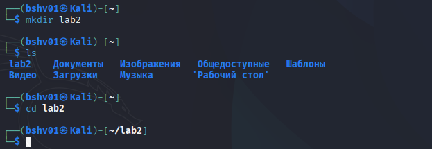
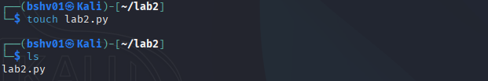
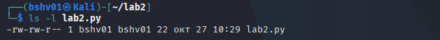
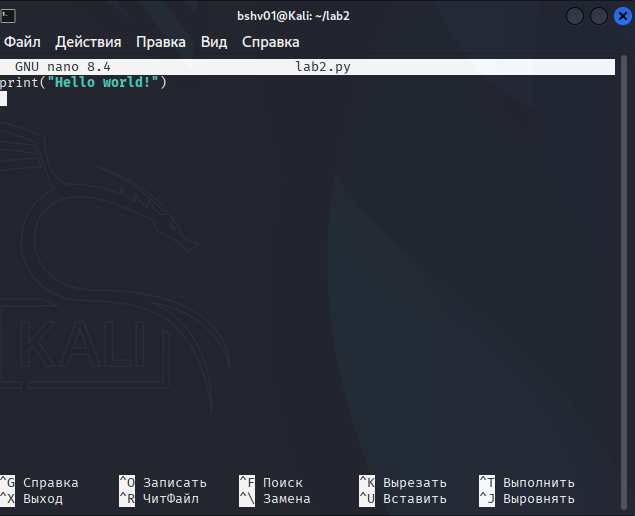
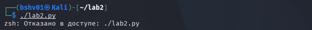
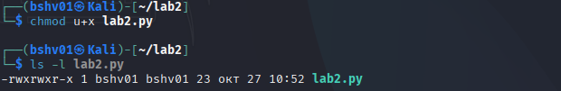
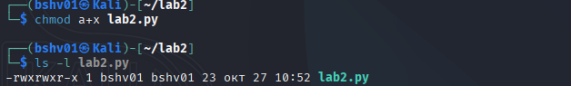
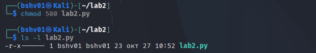
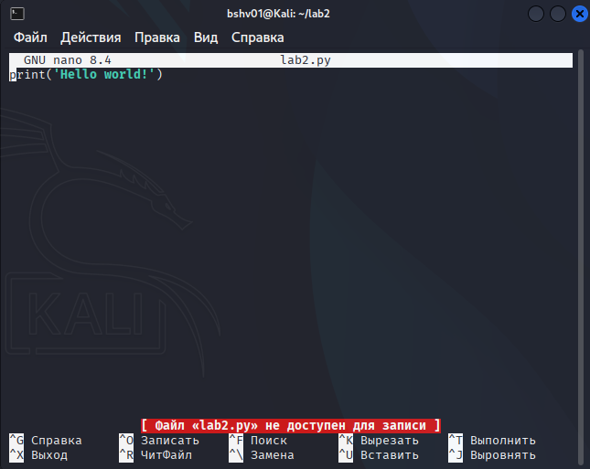
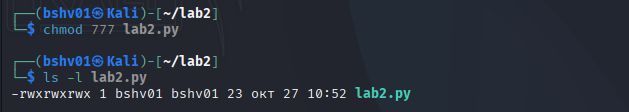

## Лабораторная работа №2

**Задача:** Ознакомиться с системой прав доступа в операционной системе Linux и научиться изменять права на файлы с помощью команды chmod в символьной и числовой форме.

**Шаг 1:** Создание папки и переход в неё

Создал новую рабочую директорию lab2 и перешёл в неё для выполнения лабораторной работы.

**Шаг 2:** Создание файла с Python-кодом

Создал файл lab2.py и записал в него короткий код, который выводит приветственное сообщение.

**Шаг 3:** Проверка исходных прав файла

С помощью команды ls -l посмотрел текущие права доступа к файлу lab2.py.

**Шаг 3.1** Открытие файла и запись

Открыл файл командой nano и записал в файл Python код.

**Шаг 4:** Попытка запуска файла без прав на выполнение

Попробовал запустить скрипт напрямую — система выдала ошибку «Отказано в доступе», так как у файла нет права на выполнение.

**Шаг 5:** Добавление права на выполнение

Командой chmod u+x lab2.py разрешил выполнение файла. Проверил изменения через ls -l.

**Шаг 5.1:** Добавление права на выполнение всем пользователям

Командой chmod a+x lab2.py дал право на запуск файла всем пользователям системы.

**Шаг 5.2:** Изменение прав с помощью числовых значений

Назначил права только владельцу (чтение и выполнение), а группе и остальным пользователям запретил доступ.

**Шаг 5.3:** Установка прав полного доступа

Разрешил всем пользователям читать, изменять и выполнять файл без ограничений.